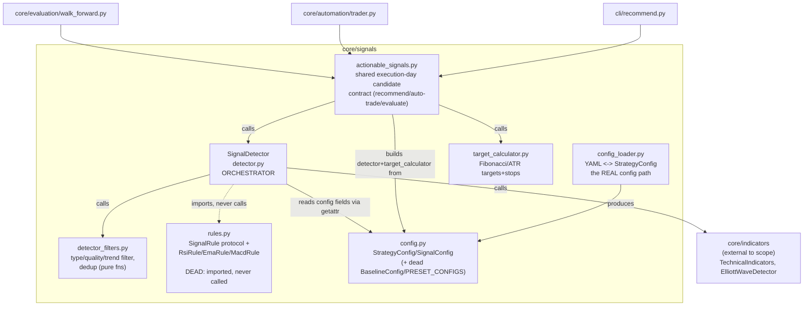

# Architecture audit: core/automation + core/signals

Scope per instructions: only `core/automation/` and `core/signals/` got per-file drift/dead-code
work. Callers outside that scope (`cli/*`, `services/ibkr-broker`, `worker/*`, `spec/*`,
`DEVELOPMENT.md`, tests) were read only to resolve reachability, never audited for their own
internal quality.

**Process notes (constraints for this run):**

- No subagents were spawned. The skill calls for Haiku-per-file-batch (Phase 1), Sonnet-per-unit
  (Phase 2) and Opus-boundary (Phase 3) fan-out. With 13 files (~5,200 lines) I instead read every
  file directly in one thread and did the drift/reachability/fitness reasoning myself. Where the
  skill would have fanned out, that's noted inline below — the main cost is that batching didn't
  happen, not that any phase was skipped.
- Human unavailable, so Phase 0's opening question was never asked live. Here is exactly what I
  would have asked, and the answer I assumed and proceeded on:
  - **Q1 (purpose):** *"I understand `core/signals` + `core/automation` exist to turn price
    history into a trading decision and then place/track that decision at a real broker, with the
    hard invariant that live and backtest must agree on every signal (truncation invariance) and
    that broker order/position identity must never be misattributed (permId, not orderId). Is
    that the value this code protects?"* **Assumed answer: yes** — this is stated almost verbatim
    across `CLAUDE.md`, `spec/live-trading.md`, and the "Live order identity (IBKR)" gotcha
    section, so confidence is high.
  - **Q2 (preflight gaps):** preflight reported **no gaps** for this scope (Python via Docker
    fully usable for both harvest and `vulture`), so there was nothing to trade off.
- All Python execution (symbol harvest, `vulture`) ran in `python:3-slim` via `docker run`, never
  on the host.
- No git write operations were run (read-only `git log`/`git ls-files` only).

## Purpose (confirmed)

Turn price series into trading signals via one shared detector (`core/signals`), then place and
track the resulting orders at a real broker while keeping local state in sync with broker truth
(`core/automation`). The value chain: **prices → signal (must be causal/truncation-invariant) →
sized order → placed at broker → reconciled against broker truth → correctly labelled outcome**.
The thing that must not break, per the project's own incident history: (1) a signal computed live
must equal the signal computed in backtest for the same bar, and (2) an order/position must never
be identified by the wrong id or silently mislabelled when the broker's session-scoped ids get
reused.

## Fitness findings

Ranked by cost to that goal if wrong, worst first.

### 1. The documented way to add a signal rule has been dead code since detector.py stopped calling it

`core/signals/rules.py` defines a `SignalRule` protocol plus `RsiRule`, `EmaRule`, `MacdRule`, and
`get_technical_rules(config)`. `core/signals/detector.py:28` imports `get_technical_rules` — and
never calls it. The real signal-generation loop,
`SignalDetector._get_technical_indicator_signals` (`core/signals/detector.py:251-371`),
independently reimplements the exact same RSI/EMA/MACD crossover conditions inline as vectorized
pandas boolean masks. Two implementations of "RSI exit-oversold ⇒ buy" etc. exist; only the inline
one runs.

This isn't just dead code — it's **actively wrong onboarding documentation**.
`DEVELOPMENT.md:238-242` tells a future engineer, in an "Add New Technical Indicator Rule" recipe:
> 1. In `core/signals/rules.py`: implement a class with `evaluate(row, prev_row, config) -> (...)`
>    (satisfies `SignalRule` protocol).
> 2. Register it in `get_technical_rules(config)` so it runs when the corresponding config flag is
>    set.

Following that recipe today produces a rule that **never fires**, because nothing in the
production path consults `get_technical_rules`. `rules.py` is also eagerly re-exported as
first-class public API from `core/signals/__init__.py` (`SignalRule`, `RsiRule`, `EmaRule`,
`MacdRule`, `get_technical_rules` are all in `__all__`), which reinforces that it looks load-bearing.
Only `tests/test_signals/test_rules.py` exercises it.
`DEVELOPMENT.md:235` also tells engineers to "reuse `_filter_signals_by_quality`,
`_deduplicate_signals`" for a new signal source — `_deduplicate_signals`
(`core/signals/detector.py:893-895`) is itself a dead wrapper (see Unit findings); the real pipeline
calls the module-level `deduplicate_signals` directly.

**Cost if wrong:** silent — a new rule "written correctly" per the docs produces no behavior
change, no error, no test failure outside `test_rules.py`. Given the project's stated tuning
protocol ("Validate on a held-out universe... before believing an edge"), a researcher could burn
a full tuning cycle on a rule that was never in the loop.

### 2. Two live-trading state backends, not at parity, with the gap invisible at the call site

`core/automation/state.py::StateManager` (JSON file) and `core/automation/pg_state.py::PgStateManager`
(postgres) are meant to be interchangeable — `pg_state.py:1` literally says "drop-in for
StateManager" — but they are not. `AutomatedTrader` (`core/automation/trader.py`) and
`reconcile()` (`core/automation/reconcile.py`) gate every postgres-only capability behind
`hasattr(state_manager, "...")`:

- `reconcile.py:101` `upsert_position`/`prune_positions` (broker position sync) — pg-only.
- `reconcile.py:116-124` `record_fill` (exec-id-deduped fill recording) — pg-only.
- `reconcile.py:130-133` `load_active_orders` — pg-only; JSON path falls back to iterating
  `state_manager.orders.values()` with no active/terminal distinction beyond what's already there.
- `reconcile.py:181-187`, `195-238` `set_status`, `close_trade_log`, `load_unstamped_closures` —
  all pg-only. This is precisely the machinery `CLAUDE.md`'s "Live order identity (IBKR)" section
  describes as fixing real hydra incidents: permId-vs-orderId identity, `dead_on_arrival`
  detection, the `expired`-vs-`closed` distinction, the unstamped-closure healing sweep.
- `trader.py:583-602`, `674-693` `update_signal_traded`, `append_trade_log`, `set_status`,
  `upsert_position` — same pattern, same gate.

`StateManager` (JSON) implements none of these. So the docker-compose path — `cli/auto_trade.py`,
run via `make auto-trade`, documented in `README.md:174-198` as "Automated Trading (IBKR Paper
Account)" and *not* marked deprecated — gets basic `add_order` + pending/filled/closed transitions
only. It never gets position sync, fill recording, or outcome classification/healing. Nothing
raises or logs a warning when a capability is silently skipped; `hasattr` just makes the block a
no-op.

Compounding this: `spec/live-trading.md:16-19` — the canonical spec for "the live/paper trading
path" — states as the current design: *"Order/position/fill state lives in postgres (no
JSON/CSV local state) — so runs are stateless"* and *"The cluster (not an in-process daemon) owns
market-hours scheduling."* That is a direct description of the `pg_state.py` +
`cli/livetrade_cycle.py` path and a direct **non**-description of `cli/auto_trade.py` +
`core/automation/scheduler.py` + `StateManager`, which still exists, is still documented as a
primary quick-start in `README.md`, and is the *only* consumer of `Scheduler` (confirmed: `rg` finds
`Scheduler` used nowhere but `cli/auto_trade.py`) and of `StateManager`. Git history reinforces the
gap: `pg_state.py`, `trader.py`, `reconcile.py`, `cli/livetrade_cycle.py` were all touched in the
last two days (2026-07-25 to 07-27, the exact incident-fix burst `CLAUDE.md` documents);
`core/automation/scheduler.py` was last touched 2026-05-25 and `cli/auto_trade.py` 2026-06-02 —
neither received any of the hardening.

**Cost if wrong:** this is the highest-cost finding in scope. If `cli/auto_trade.py` is ever
pointed at a live (non-paper) account — which `README.md` frames as a mode switch, not a
prohibition — every failure mode `CLAUDE.md` documents as "fixed" (stale-orderId mismatches,
trades mislabelled `expired` from missing fills, no position-sync-driven UI truth) is **live
again**, because the fix lives entirely in `pg_state.py`/`reconcile.py`'s pg-only branches. Nobody
auditing "is reconcile correct" from `reconcile.py` alone would notice, because the file makes the
degradation look like a deliberate, symmetric duck-typed fallback rather than a two-tier system
where one tier lost a year of incident-driven correctness work.

### 3. The dedicated causality regression test exercises a method production never calls

`tests/test_signals/test_mtf_causality.py` — the test the project's own gotcha list points to as
*the* template for a new truncation-invariance test — calls
`detector._filter_signals_by_multi_timeframe(...)` (`test_mtf_causality.py:40`). That method
(`core/signals/detector.py:176-215`) has **no production caller** (confirmed by `rg`: every other
hit is a test). The actual production path,
`SignalDetector.detect_signals_with_indicators` (`detector.py:136-160`), builds `mtf_lookup` via
`_build_mtf_ensemble` and does its own inline `mtf_confirms` assignment + filter — it never calls
`_filter_signals_by_multi_timeframe`.

The two paths share `_build_mtf_ensemble` (the function that actually enforces "only completed
prior weeks," i.e. the causal core), so the regression test does still cover the piece that once
leaked look-ahead. But the *outer* decision — which signals survive, how `mtf_confirms` is set —
is duplicated logic, one copy dead, one copy live, and the dedicated test binds to the dead one.
A future edit to the live inline filter (`detector.py:149-160`) that reintroduces look-ahead in
the outer logic (not inside `_build_mtf_ensemble`) would not be caught by
`test_mtf_causality.py`, despite that file's docstring explicitly framing itself as "pins the
contract."

**Cost if wrong:** matches the project's own worst historical bug (MTF weekly look-ahead, "sim
trades, live finds 0") almost exactly, and the regression suite meant to prevent a recurrence has
a blind spot at the one place a recurrence would most plausibly reappear (the outer filter, not
the ensemble builder).

### Where the structure is fine (said plainly, per the skill's instruction)

- `core/signals/target_calculator.py`, `core/signals/detector_filters.py`'s actual filter
  functions, `core/automation/reconcile.py`'s `classify_outcome`/`_stamp_unstamped_closures`
  logic, and `core/signals/actionable_signals.py`'s execution-day/single-pass-vs-windowed split are
  all well-documented, internally consistent, and match their names. The single-pass-vs-windowed
  duplication in `actionable_signals.py` looks like it could be a convergence-audit target, but its
  own docstring (`generate_signals_single_pass:439`) is explicit that the two paths are a
  **deliberate** methodology divergence, not drift — that's a design note, not a defect.
- The lazy-import pattern in `core/automation/__init__.py` (PEP 562 `__getattr__`/`__dir__`) is
  purpose-built, documented with the exact incident it fixes (an eager import of `Scheduler`
  dragging in `pytz` and killing `ibkr-broker`), and does its job. `vulture` flags `__getattr__`/
  `__dir__` as "unused" — false positive, they're a Python protocol hook, not application code.

## Boundary findings

- **Bypassed abstraction:** `rules.py`'s `SignalRule` protocol is bypassed by `detector.py`'s own
  inline reimplementation (see Fitness #1). This is the clearest bypassed-abstraction in scope:
  the abstraction exists, is imported, is documented as the extension point, and is walked around.
- **Silent capability degradation across an interface boundary:** `reconcile()` and `trader.py`
  treat `StateManager` and `PgStateManager` as satisfying one implicit interface via `hasattr`
  checks, but the interface was never written down (no `Protocol`, no ABC) and the two
  implementations diverge in exactly the methods that carry the project's hardest-won correctness
  fixes (see Fitness #2). This is contract drift without an explicit contract to drift from —
  worse than a typed interface violation because nothing can even flag it as a violation.
- **Doc-vs-code at the architecture-doc level**, not just docstrings: `DEVELOPMENT.md:280-284`
  ("Add New Strategy Preset" → edit `PRESET_CONFIGS`, use `--preset` on `make evaluate`) describes
  a workflow that no longer exists — `cli/evaluate.py` has no `--preset` flag at all (confirmed by
  `grep`; only `--config <yaml>` is accepted). `PRESET_CONFIGS`/`BaselineConfig` are legacy from
  before the YAML/CR config system (`core/signals/config_loader.py`) replaced them. See Doc
  reality check below.

## Unit findings — core/automation

- **God-file-adjacent but not quite:** `trader.py` (738 lines) mixes signal-candidate selection,
  order placement, state-manager fan-out (via repeated `hasattr` checks), and trade-log CSV
  writing. Each responsibility is coherent on its own; the `hasattr` fan-out pattern repeated 7+
  times (lines 583, 588, 674, 681, 688, 693, and in `reconcile.py`) is the real smell — it's doing
  the job an explicit `Protocol`/capability object should do.
- **Layering is otherwise clean:** `reconcile.py`'s docstring explains *why* it's independent of
  `AutomatedTrader` (so the ibkr-broker service's 60s tick doesn't need a strategy config) — this
  is a good, load-bearing design note, not drift.
- `core/automation/scheduler.py` is a well-formed, internally honest module (its
  `is_market_holiday` docstring accurately flags itself as "simplified... for production use a
  proper calendar"), but per Fitness #2 it is single-purpose infrastructure for a path
  (`cli/auto_trade.py`) that the project's own spec describes as superseded.

## Unit findings — core/signals

- `core/signals/config.py` mixes the live `StrategyConfig`/`SignalConfig` dataclasses (used
  everywhere) with a fully dead legacy subsystem (`BaselineConfig`, `PRESET_CONFIGS`, see Dead
  code). The dead subsystem also carries stale, uncheckable performance claims baked into string
  literals (e.g. `config.py:340` `"Elliott Wave + RSI + EMA + MACD - Best performing strategy
  (+45.75% alpha)"`) — exactly the kind of "X is optimal" claim without circumstances that
  `HYPOTHESIS_TEST_RESULTS.md`'s own conventions warn against, except here it's frozen in code
  nobody reads or runs.
- `core/signals/actionable_signals.py` is the best-organized file in scope: one shared module
  genuinely used by `recommend`/`auto-trade`/`evaluate` (per its own docstring, confirmed by
  `DEVELOPMENT.md:304`), with one now-legacy function (`get_actionable_signals_for_date`) kept
  alive only by a temporal-invariance test — see Dead code.
- `core/signals/rules.py` is well-written *in isolation* (clean `Protocol`, three small correct
  rule classes, docstrings match bodies) — its problem is entirely reachability, not internal
  quality (see Fitness #1).

## Drift lines

Format: `path:line | verdict | note`

- `core/signals/detector_filters.py:4` | **DRIFT** | Module docstring says dedup is "by (date,
  signal_type)"; the function two lines below it (`deduplicate_signals:121`) correctly documents
  and implements the actual key as `(timestamp, signal_type, price)`. The module header is stale
  relative to its own function.
- `core/automation/state.py:58-67` (class docstring) | **DRIFT** | Claims responsibility "Prevent
  duplicate orders for same instrument/day" via `has_order_for_instrument_today`. That method is
  never called by production code on either `StateManager` or `PgStateManager` — real duplicate
  prevention is `AutomatedTrader.should_skip_signal` (`trader.py:322-364`), which queries the
  broker directly. The class docstring describes a mechanism the class doesn't actually provide.
- `core/signals/detector.py:495-519, 570-589` (`_wave_to_signal`, `_inverted_wave_to_signal`) |
  **DRIFT / dead computation** | Each branch computes a `base_confidence` scaled by wave label
  (`wave.confidence * 0.7/0.8/0.9`) that reads as if it differentiates the signal's confidence by
  wave type — but every `Signal(...)` construction hardcodes `confidence_score=0.0` with the
  comment "scored in `_score_signals` pass," so `base_confidence` is computed and then discarded
  in all six branches. The wave-label confidence differentiation the variable name implies does
  not reach the signal. Either dead leftover from a pre-refactor scoring model, or a real lost
  signal — worth a decision, not just cleanup.
- `core/signals/detector.py:176-215` (`_filter_signals_by_multi_timeframe`) | **MISNAMED /
  dead** | Docstring and name describe the live MTF-filter behavior accurately, but it's not the
  code path that runs; see Fitness #3.
- `core/automation/pg_state.py:196-199` (`state_file` property) | **MATCH** | Docstring correctly
  labels itself "Compat shim." No drift — flagged only because `vulture` initially suggested a
  dead attribute; it's real and load-bearing for `trader.py:139`.
- `core/signals/config_loader.py:245` (`config._yaml_path`) | **MATCH** | Comment claims it's read
  "later... for copying to results"; confirmed real consumer at
  `core/orchestration/orchestrator.py:614-616`. `vulture`'s "unused attribute" flag is a false
  positive from dynamic `getattr`/`setattr` it can't trace — noted since it's the same shape as
  several other false positives below.

## Dead code (confirmed via `rg` across the whole repo, not just scope)

- `core/signals/rules.py` — entire module unreachable from production (`SignalRule`, `RsiRule`,
  `EmaRule`, `MacdRule`, `get_technical_rules`); see Fitness #1. Test-only.
- `core/signals/config.py:598-639` — `BaselineConfig` class (`get_baseline`, `get_preset`,
  `list_presets`, `create_custom`) and the `PRESET_CONFIGS` dict it wraps: zero callers anywhere
  in the repo, including tests. `BASELINE_CONFIG` (the single object, not the dict/class) *is*
  used and is fine.
- `core/signals/actionable_signals.py:205-283` — `get_actionable_signals_for_date`: superseded by
  `get_execution_day_candidates_for_instrument` (the one `recommend`/`auto-trade`/`evaluate`
  actually share); kept alive only by `tests/test_signals/test_temporal_invariance.py`.
- `core/signals/detector.py:893-895` — `_deduplicate_signals` method: unused wrapper; production
  calls the module-level `deduplicate_signals` directly (`detector.py:171`).
- `core/automation/state.py:224-244` — `update_order_status`: zero callers anywhere, including
  tests.
- `core/automation/state.py:265-276` — `get_all_instruments_with_orders_today`: zero callers; its
  only internal dependency, `get_orders_for_date` (`state.py:146`), also has no external caller.
- `core/automation/state.py:121-144` / `pg_state.py:105-116` — `has_order_for_instrument_today` on
  *both* state managers: test-only on both; the real dedup path bypasses it entirely (see Drift
  lines).
- `core/automation/state.py:22` — `OrderStatus.CANCELLED`: referenced in one read filter
  (`pg_state.py:266`, the unstamped-closures sweep) but never *written* anywhere in the repo — no
  code path can put an order into this state. Either a genuinely missing cancel-handling path or
  a vestigial enum member; worth a decision.

**False positives from `vulture`** (over-reports dead, as the skill's reference predicts — confirmed
reachable via `rg` before trusting the tool):
`core/automation/__init__.py` `__getattr__`/`__dir__` (Python protocol hooks); `pg_state.py`
`has_order_for_instrument_today`/`cleanup_old_records`/`append_cycle_heartbeat` (all called from
`cli/livetrade_cycle.py`, outside scope but the only caller); `scheduler.py`'s whole class and its
`wait_for_market_close/open`, `mark_processed`, `sleep_until_next_day` (all called from
`cli/auto_trade.py` — real, just single-consumer, see Fitness #2); `state.py`
`update_order_status`/`cleanup_old_records` (the *class* methods vulture flagged are partly real —
`cleanup_old_records` is called, `update_order_status` is not, see above — vulture doesn't
distinguish); `config.py`'s liquidity-cost fields (`use_confirmation_modulation`,
`confirmation_size_factors`, `max_participation_pct`, `adv_window`, `adv_stat`, `impact_coef`) —
all real, read via `getattr(config, ...)` in `core/evaluation/{portfolio,walk_forward,edge}.py`
and `worker/simulation.py`, which static analysis on dataclass fields can't see;
`config_loader.py:250` `save_config_to_yaml` — real, called from `cli/livetrade_cycle.py` per the
serialization round-trip contract `CLAUDE.md` documents.

## Doc reality check

No pre-existing architecture diagram/spec was found scoped to exactly `core/automation` +
`core/signals` (the closest are `spec/live-trading.md`, which documents the *target* pg-only
architecture, and `DEVELOPMENT.md`, which documents both current and superseded mechanisms without
distinguishing them) — so this doubles as first-pass doc-vs-code rather than a stale-diagram
check. Concretely stale doc claims found:

- `DEVELOPMENT.md:238-242` describes `rules.py`/`get_technical_rules` as the live extension point.
  It is dead (Fitness #1).
- `DEVELOPMENT.md:280-284` describes `PRESET_CONFIGS` + `make evaluate --preset` as the live way
  to add a strategy preset. `--preset` does not exist on `cli/evaluate.py`; `PRESET_CONFIGS` has
  no caller.
- `spec/live-trading.md:16-19` describes "no JSON/CSV local state" and cluster-owned scheduling as
  *the* live-trading architecture. `core/automation/state.py` (JSON) and
  `core/automation/scheduler.py` (in-process) still exist, are still wired into a documented,
  non-deprecated `make auto-trade` path, and are not mentioned anywhere in `spec/live-trading.md`
  as a second, lesser-supported mode. If that's intentional (spec covers only the cluster path by
  design), it should say so; if not, the spec and the docker-compose path have diverged.

## Diagrams

Both diagrams are also the answer to "where would these have been written in the repo": there is
no `spec/architecture/` directory, so per the skill these would have gone to
`spec/architecture/overview.md` (repo-wide) plus `spec/architecture/core-signals.md` and
`spec/architecture/core-automation.md`. They are written here in the workspace instead, per this
run's instructions.

### core/signals — component view



### core/automation — component view

```mermaid
flowchart TD
  subgraph automation["core/automation"]
    trader["AutomatedTrader\ntrader.py\nORCHESTRATOR: analyze -> size -> place -> record"]
    reconcile["reconcile()\nreconcile.py\nbroker-truth sync, shared by 2 callers"]
    state["StateManager (JSON)\nstate.py\nlocal-only, partial interface"]
    pgstate["PgStateManager\npg_state.py\npostgres, full interface,\nall the incident-fix logic"]
    sched["Scheduler\nscheduler.py\nin-process market-hours polling\nSOLE caller: cli/auto_trade.py"]
  end
  broker["core/broker\n(IBKRClient, OrderBuilder)"]

  trader -->|reconcile_with_broker delegates to| reconcile
  reconcile -->|hasattr-gated calls:\nupsert_position/record_fill/\nload_active_orders/set_status/\nclose_trade_log/load_unstamped_closures| pgstate
  reconcile -.->|same calls silently no-op\n(method doesn't exist)| state
  trader -->|state_manager.add_order etc,\nsame hasattr-gated pattern| state
  trader -->|same| pgstate
  trader --> broker

  ac["cli/auto_trade.py\n(make auto-trade,\ndocker-compose service)"] --> sched
  ac --> trader
  ac -->|passes JSON state_manager| state
  lc["cli/livetrade_cycle.py\n(k8s CronJob,\nhydra production path)"] --> trader
  lc -->|passes pg state_manager| pgstate
  broker2["services/ibkr-broker\n(60s reconcile tick)"] --> reconcile
```

## Task list

- Decide `core/signals/rules.py`'s fate: either wire `get_technical_rules` into
  `_get_technical_indicator_signals` for real, or delete the module + its `__init__.py` export and
  fix `DEVELOPMENT.md:238-242` so the documented extension point matches reality.
- Decide whether `cli/auto_trade.py` (`make auto-trade`) is still a supported live-trading mode or
  a superseded local-dev path. If supported: port the pg-only reconcile/trade-log capabilities
  (`upsert_position`, `record_fill`, `load_active_orders`, `close_trade_log`,
  `load_unstamped_closures`) onto `StateManager`, or make the missing capabilities loud (raise/log
  a warning) instead of silent `hasattr` no-ops. If superseded: mark it deprecated in `README.md`
  and `spec/live-trading.md`, or remove `cli/auto_trade.py` + `scheduler.py` + the JSON
  `StateManager` path.
- Add a truncation-invariance test against the actual production path
  (`SignalDetector.detect_signals_with_indicators`'s inline MTF filter,
  `detector.py:136-160`), not just `_filter_signals_by_multi_timeframe`. Then decide whether the
  latter can be deleted.
- Delete or wire up dead code: `core/signals/config.py` `BaselineConfig` + `PRESET_CONFIGS` (and
  fix `DEVELOPMENT.md:280-284`'s "Add New Strategy Preset" recipe to describe the real YAML/CR
  flow); `core/automation/state.py` `update_order_status`, `get_all_instruments_with_orders_today`,
  `get_orders_for_date`; `core/signals/detector.py` `_deduplicate_signals`;
  `has_order_for_instrument_today` on both state managers (or wire it into `should_skip_signal` if
  the broker round-trip it currently does is meant to be a fallback rather than the only check).
- Resolve the `base_confidence` computation in `detector.py`'s `_wave_to_signal` /
  `_inverted_wave_to_signal` (six branches): either feed it into the unified `_score_signals` pass
  or delete the dead computation and the misleading per-label multipliers.
- Either implement an order-cancellation path that can produce `OrderStatus.CANCELLED`, or remove
  it from the enum/queries and document that the state machine only ever reaches
  pending → filled/closed.
- Fix the module docstring in `core/signals/detector_filters.py:4` (dedup key omits `price`).
- Update `core/automation/state.py:58-67`'s class docstring to stop claiming
  `has_order_for_instrument_today`-based duplicate prevention it doesn't provide.
