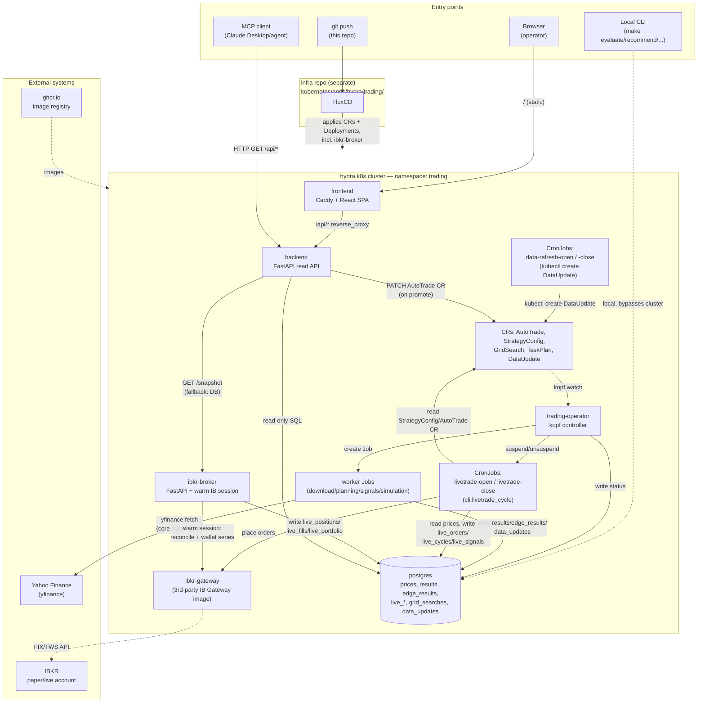

# Architecture overview — container/boundary map

> Intended repo path: `spec/architecture/overview.md` (this run did not write into the
> repo; see the accompanying `report.md` for why and for the full findings).

Scope: service/boundary level only (C4 "container" tier — deployables, datastores,
external systems, entry points). No per-file/component diagrams were produced this run
(see report §Method).

## System context

## Notes on this diagram

- **`ibkr-broker` is not wired in this repo's own `k8s/kustomization.yaml`** — its local
  `services/ibkr-broker/kustomization.yaml` is `resources: []`. Its Deployment/Service
  live only in the separate infra repo
  (`kubernetes/apps/hydra/trading/{deployment,service}-ibkr-broker.yaml`), the same
  GitOps split CLAUDE.md documents for the `AutoTrade` CR. It is real and running in
  production, just invisible if you only read this repo. See report §Boundary findings.
- **Local dev path** (`docker-compose.yml`: `postgres`, `cli`, `ibkr-gateway`,
  `auto-trader`) is a second, smaller topology used for iteration — it talks to the same
  `core/` code but never touches the cluster, the operator, or `ibkr-broker`.
- `trading_mcp` is not a deployed service; it's a local MCP wrapper (mounted into the
  `cli` compose service) that calls the backend's public `/api/*` over HTTP, same as the
  browser does.
