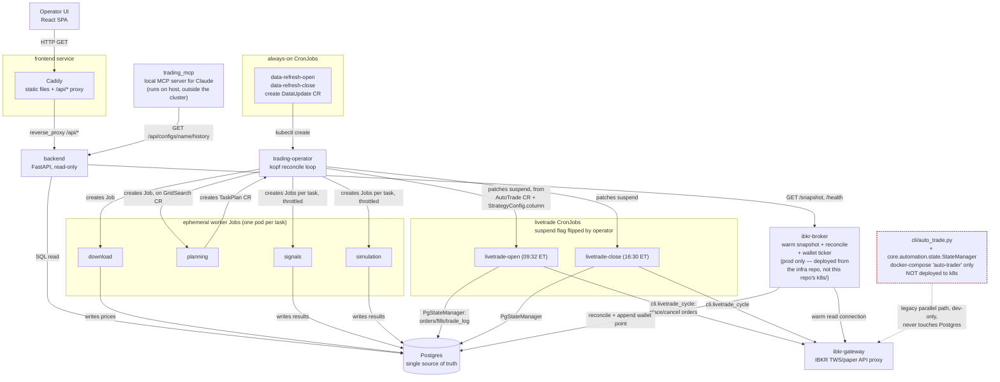

# Trading system — container/boundary map

Destined for `DEVELOPMENT.md` under "Distributed compute & live trading" (that
section currently describes this only in prose — see `spec/README.md` for the
existing higher-altitude flowchart it would sit alongside). Written here
instead per this run's constraint not to write into the repo.

## Legend

- Solid arrow = live, confirmed-reachable edge.
- Dashed red = reachable only from local dev tooling / tests, not from any
  deployed environment — a parallel path, not part of the production system.

## What's NOT dead despite looking it at first glance

- **`ibkr-broker`** has an empty `kustomization.yaml` (`resources: []`) in
  *this* repo's `k8s/`, and no `deployment.yaml`/`service.yaml` here at all —
  a repo-only reader would call it dead. It is deployed and wired
  (`readinessProbe` on `/health`, `backend`'s `IBKR_BROKER_URL` pointing at
  it) from the **separate infra repo**
  (`~/code/thetillhoff/infra/kubernetes/apps/hydra/trading/`), because the
  local `kind` overlay has no real IBKR connection to warm-cache. Both its
  endpoints (`/snapshot`, `/health`) are live.
