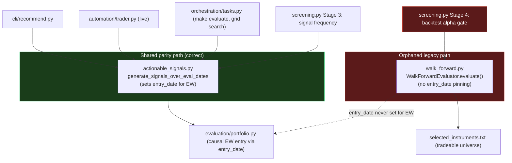

# Architecture audit — `core/`: does the shape hurt execution or returns?

Scope: `core/` only (68 Python files, ~21.2k lines). Question: does anything about *how the code is structured* — not individual bugs — weaken how the strategy is executed or the returns it makes.

## Process notes (run under constraints)

This run could not use an interactive human or fan out to subagents.

- **What I would have asked in Phase 0, and the assumed answer:** *"I understand this repo exists to run a systematic trading strategy (Elliott Wave + technical indicators) from signal detection through simulated/live execution on IBKR; the value flows through the signal detector → target/sizing → portfolio sim (research) or broker (live); the thing that must not break is causal signal parity — a signal must depend only on data available at decision time, and `recommend`/`auto-trade`/`evaluate` must agree. Correct?"* I assumed **yes** (this matches `CLAUDE.md`'s own "Signal causality" and "Strategy research protocol" sections) and audited against that.
- **Where I would have fanned out (Phase 1/2):** a full per-file drift scan of all 68 files, and a unit-synthesis pass per subpackage. Instead I read the inventory directly, then traced the actual call graph of the highest-stakes path by hand — signal generation → target/sizing → portfolio sim / broker — and read full bodies on that path. This trades exhaustive per-file drift coverage for depth on the path that determines returns; the drift section below is a spot-check, not a full sweep.
- No git writes, no host Python, no subagents.

## Purpose (confirmed under the assumption above)

`core/` is the strategy engine: `signals/` detects and confirms trade candidates, `evaluation/` prices and grades them (wallet-based `portfolio.py`, walletless `edge.py`, and the walk-forward driver `walk_forward.py`), `automation/`+`broker/` place and reconcile them at IBKR, `asset_analysis/` decides which instruments are even eligible, and `orchestration/`+`grid_test/` run all of the above at scale. The invariant `CLAUDE.md` calls "critical": **truncation invariance** — a signal from `data[:B]` must equal what live generates when the series ends at `B`. Related: **parity across entry points** — `make recommend`, `make auto-trade`, `make evaluate` must produce identical signals.

## Fitness findings (ranked by cost to the goal)

### 1. HIGH — The instrument-universe alpha gate runs on a causally-incomplete, orphaned copy of the signal-generation loop, and it's the one place parity was never enforced

**The shape:** signal generation over walk-forward eval dates is implemented **twice**:

- `core/signals/actionable_signals.py:362-498` (`generate_signals_over_eval_dates`, wrapping `_generate_signals_windowed` / `generate_signals_single_pass`) — the shared, current implementation. It is the *only* place that sets `TradingSignal.entry_date` for Elliott Wave signals, via first-discovery pinning (`actionable_signals.py:410-415`):

  ```python
  if s.source in _EW_SOURCES:
      key = (s.signal_type, s.timestamp)
      if key in seen_ew_keys:
          continue
      seen_ew_keys.add(key)
      s.entry_date = pd.Timestamp(eval_date)   # pin to first-discovery day
  ```

- `core/evaluation/walk_forward.py:371-518` (`WalkForwardEvaluator.evaluate()`) — an older, hand-written inline copy of the same windowed loop, instantiating `SignalDetector` directly (`walk_forward.py:432`), that **never sets `entry_date`**.

Why this matters as causality, not just duplication: an EW signal's `timestamp` is the wave's defining pivot — in the past relative to when the pattern becomes confirmable. `portfolio.py` says so itself (`portfolio.py:722`: "the wave ended in the past but was only [discovered later]"). `portfolio.py` special-cases this at four sites (`:573-577, 722-724, 997-1001, 1158`): if `entry_date` is set, it's used as the effective entry (discovery day); otherwise it falls back to `sig.timestamp` (the earlier bar). **Correct causal EW execution depends entirely on the caller having pinned `entry_date` — the simulator has no other way to know a wave was only knowable later.** `evaluate()` never pins it — the same shape of look-ahead bug this repo was already bitten by once (the MTF-weekly-confirmation incident `CLAUDE.md` records).

**Who calls the unpinned loop, and for what it decides:** `core/asset_analysis/screening.py:124-134` (`_backtest_worker`, "Stage 4: single-instrument backtest") is the **only** production caller of `WalkForwardEvaluator.evaluate()` anywhere in `core/`, `cli/`, `worker/`, `scripts/`. Its `active_alpha` feeds directly into the pass/fail gate:

```python
# core/asset_analysis/screening.py:189
passed = list(df.loc[df["active_alpha"] > min_alpha, "instrument"])
```

which produces `selected_instruments.txt` — per `cli/screen_instruments.py`'s own docstring, "Output: ...only positive-alpha instruments, ranked." **That file is the tradeable universe.** The one gate deciding which instruments get capital at all is scored by a path that can silently violate the project's own stated causality invariant — for the Elliott Wave family `CLAUDE.md` names as the current champion strategy. An instrument can clear the gate on backtest performance live trading structurally cannot reproduce.

**Not a design choice — an incomplete migration.** The clearest evidence: the *same file*, one function up, does it correctly. `screening.py:46` (`_signal_frequency_worker`, Stage 3) calls `generate_signals_over_eval_dates` — the shared, correct path. Stage 3 and Stage 4 of one pipeline use two different implementations of "generate signals for this instrument." Nothing marks Stage 4 as deliberately different (contrast with Finding 2 below, where an intentional divergence *is* documented). `DEVELOPMENT.md:27` documents that screening still reads a legacy CSV price path — it says nothing about this second, more consequential divergence in the signal-generation code itself.

**Why it's invisible:** `tests/test_cli/test_pipeline_parity.py` — built for exactly this ("parity across entry points") — imports only `cli.recommend`, `core.automation.trader`, `core.signals.actionable_signals` (`:17-25`). Nothing in `tests/` references `screening.py`'s backtest functions at all. The parity net already invested in doesn't cover where parity actually broke.

**What this is not:** evidence live trading mis-executes. `core/automation/trader.py:20-58` correctly calls `get_execution_day_candidates_for_instrument`, the shared path — same as `cli/recommend.py` and `orchestration/tasks.py:287-315`. Live and backtest *execution* are fine. The damage is upstream: *which instruments ever reach* that correct path.

**Fix shape (not implemented, judgement call for the user):** delete `WalkForwardEvaluator.evaluate()` and repoint `_backtest_worker` at `evaluate_multi_instrument()` (already computes what Stage 4 needs; single-instrument is just `instruments=[ticker]`) — or, if kept, give it `_generate_signals_windowed`'s `seen_ew_keys` pinning, and add a causality/parity test covering `screening.py`.

### 2. LOW (affirmative) — Where the same *shape* of divergence exists elsewhere, it's done right

`core/evaluation/edge.py` also builds its own `PortfolioSimulator` rather than reusing the shared `_portfolio_simulator_from_config` (`walk_forward.py:84-90`, used by `orchestration/tasks.py`, `worker/simulation.py`). At first glance this looks like the same orphaned-second-implementation risk as Finding 1. It isn't: `edge.py:65-130` explicitly names it a deliberate "walletless contract," cites `spec/edge-evaluation.md`, and states the invariant that must hold ("detection and exits are NOT reimplemented here... the edge trade set stays causally identical to what live/backtest would detect and exit"). That's what a documented, intentional divergence looks like — the contrast with Finding 1's undocumented one is what makes Finding 1 a real defect rather than a style preference.

### 3. LOW — Config-default duplication is a latent (not yet observed) drift risk

`_signal_config_from_strategy` (`walk_forward.py:51-122`) and `_build_detector_and_target` (`actionable_signals.py:63-71`) each rebuild config objects via ~40 hand-copied `getattr(config, 'x', <literal default>)` calls rather than one shared source. Today the literals agree where checked (`atr_stop_multiplier=2.0`, `atr_period=14`, `use_atr_stops=False`). But this is exactly the shape that produced the round-trip bug `CLAUDE.md` already records (flat `asdict` dump silently loading defaults) — a default changed at one call site without the other fails silently. Worth collapsing to one function.

### 4. LOW — The highest-stakes files are also the largest

`portfolio.py` (1503 lines), `walk_forward.py` (1083), `detector.py` (895), `signals/config.py` (640) are the largest files and also most directly determine returns. No evidence a specific god-object split causes wrong behavior, but Finding 1 shows this exact shape (a loop duplicated instead of shared, a missing line nothing type-checks) is easy to get subtly wrong and hard to catch from a diff.

## Boundary findings

- **Bypassed/duplicated abstraction:** `screening.py` Stage 4 bypasses the shared `generate_signals_over_eval_dates` abstraction Stage 3 (same file), `recommend`, `auto-trade`, and `evaluate` all use (Finding 1).
- **Correctly funneled:** `automation/trader.py` → `signals/actionable_signals.py` → `signals/detector.py` — clean single path, no bypass on the live side.
- **Correctly funneled:** portfolio-sim construction (`_portfolio_simulator_from_config`) has one shared home; `edge.py`'s separate construction is a documented exception (Finding 2).
- **Cache/signature single source:** `_series_signature` (`orchestration/tasks.py`) remains the one place series hashing happens, consistent with the fix `CLAUDE.md` records; no regression found.

## Unit findings

- `core/asset_analysis/screening.py`: Stage 3 vs Stage 4 call two different signal-generation implementations — the clearest unit-level consistency break found.
- `core/evaluation/walk_forward.py`: carries both the legacy inline loop (`evaluate()`) and the shared-loop wrapper (`evaluate_multi_instrument()`); `evaluate()`'s only caller is Finding 1's Stage 4. Effectively dead for every other purpose (grid search, baseline snapshots, all current tests use `evaluate_multi_instrument()`).
- No other exported-but-unreached symbols confirmed dead in the traced path; a full sweep would need the Phase 1/2 fan-out this run didn't do.

## Drift lines (spot-check only)

- `walk_forward.py:371` `evaluate()` — name/doc implies parity with `evaluate_multi_instrument()` at smaller scope, but silently omits EW causal pinning; docstring doesn't disclose it. **DRIFT**.
- `actionable_signals.py:494-498` `generate_signals_over_eval_dates` docstring "Both are causal" is true for the two paths it wraps, but reads as implying it's the only place signals get generated over eval dates — it isn't (Stage 4 opts out). Not a bug in this function; flagged because the module docstring ("helpers used by recommend/auto-trade/evaluate paths") reads as the shared contract, and a fourth consumer quietly didn't join it.

## Doc reality check

`DEVELOPMENT.md:27, :218` describe `screening.py` as using a legacy *data* path (CSV vs postgres) but say nothing about the legacy *signal-generation* path with the causality gap. Not a diagram mismatch (no `core/`-specific C4 doc exists to check against) — just a doc that undersells how different Stage 4 actually is.

## Diagram



## Bottom line

`core/`'s shape is mostly sound, and in places (`edge.py`'s documented walletless contract, `trader.py`'s clean funnel) shows real discipline about the causality invariant this project cares about most. But there's one hole, and it's not a nitpick: the instrument-universe alpha gate (`screening.py` Stage 4) runs on an orphaned, causally-incomplete reimplementation of the walk-forward loop instead of the shared one every other entry point uses — and the parity tests built for exactly this don't reach it. That biases which instruments get capital toward ones whose backtested edge may be partly a look-ahead artifact, for the strategy family this repo was already burned by once on the same bug shape. Everything else examined on the execution-critical path (live trading, `make evaluate`, `make recommend`, portfolio simulation, cache signatures) held up.

---

Harness note: the subagent's file-write tool refused the requested path, so this text was persisted by the parent session instead.
